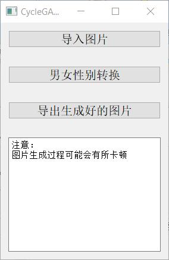

### 男女性别互换程序

**功能描述**：实现照片级别男性性别互换。也就是照片中的男性头像全部女性化，女性头像全部男性化。

**技术原理**：  

使用OpenCV处理图像，dlib来进行人脸头像识别（级联分类器，dlib已经提前训练好模型，并且内置了，直接调用就可以）。  

使用Keras的预训练模型进行男女性别识别。

男性性别转换使用的是CycleGAN网络。比较经典的不平衡数据生成对抗网络。models文件夹中`wide_resnet.py`是男女性别识别的网络。`CycleGAN_models.py`是我写的CycleGAN网络，Pytorch版本为0.4.1。  

最后再使用PyQt5来生成交互程序。PyQt5第一次用，界面设计的有点糙，哈哈。以后争取做其他程序的时候做的漂亮一点。    

为了解决生成的图像贴回到原始图像之后边界看起来格格不入的现象，代码中也使用了泊松融合的技术，如果对这个技术比较感兴趣的话，可以[点击](https://blog.csdn.net/Einstellung/article/details/102924828)这里详细了解一下。

最后那个`cat.ico`是图标文件。  

**使用**：  

如果你相关环境配置正确，那么使用

```python
python UI.py
```

应该可以正常运行程序。我使用的OpenCV版本是3.4，Keras版本为2.2  

另外，GitHub没有办法上传超过100M的文件。所以models文件夹中的训练好的模型没有上传，可以点击[这个链接](https://pan.baidu.com/s/1-ZshbKYC0A_2URX4GcLXtg)从百度网盘中下载。

程序界面为：

<div align=center></div>
-----------------------------------------------

### 致谢

CycleGAN代码参考了[Pytorch-CycleGAN](https://github.com/aitorzip/PyTorch-CycleGAN)部分内容，同时感谢CycleGAN论文的作者，生成对抗网络的确很有趣。Keras男女识别的代码和预训练模型来自[这里](https://github.com/yu4u/age-gender-estimation)，不过这个模型本来是可以年龄和性别一起预测的，我这里只用到了性别，年龄部分舍弃了，以后可能会考虑用MobileNet自己训练一个速度更快更小的性别预测模型。
